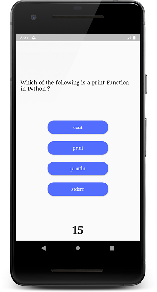
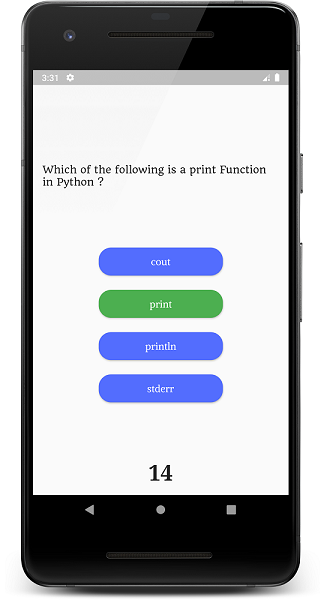
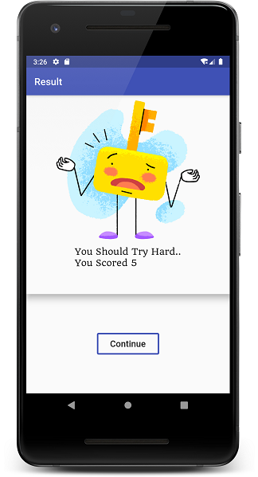

# Quizstar

This is a **Complete Quiz App in FLUTTER** using a lot of features such as
* Multiple Screens
* Timer (30 sec By Default)
* Button Color Changes On Click
* Result Page
* Questions From JSON

And a lot more...

## Watch The Complete Tutorial Here 

### [In English](https://youtu.be/yHrpx4PoBzU)
### [In Hindi](https://youtu.be/tJob-xdGLXE)


### Star It And Play With The Code

## Here Are A Few Screenshots From The App






## **Changelog/Commit 01**

  1. Updated Descriptions
  2. Added JSON Files to Open for Diffrent Cards / Languages
  3. Fixed The Code for Checking Answers..

## **Changelog/Commit 02**

  1. Updated Code To Pick Questions Randomly
  ```dart
    // extra varibale to iterate
    int j = 1;
    // to create the array elements randomly use the dart:math module
    // ----------
    // var rand = new Random();
    // for (var i = 0; i < 10; i++) {
    // print(rand.nextInt(100));
    // }
    // ----------
    var random_array = [1, 6, 7, 2, 4, 10, 8, 3, 9, 5];
  ```
  2. Changed Button Click Timer To 1 Second ( 2 sec Earlier )
  ```dart
      Timer(Duration(seconds: 1), nextquestion);
  ```
  3. many Asked How To Increase And Decrease timer Timer ! Just Change The Timer Variable 
  ```dart
      int timer = 30;
  ```

## **Changelog/Commit 02**

  *Coming SOON*